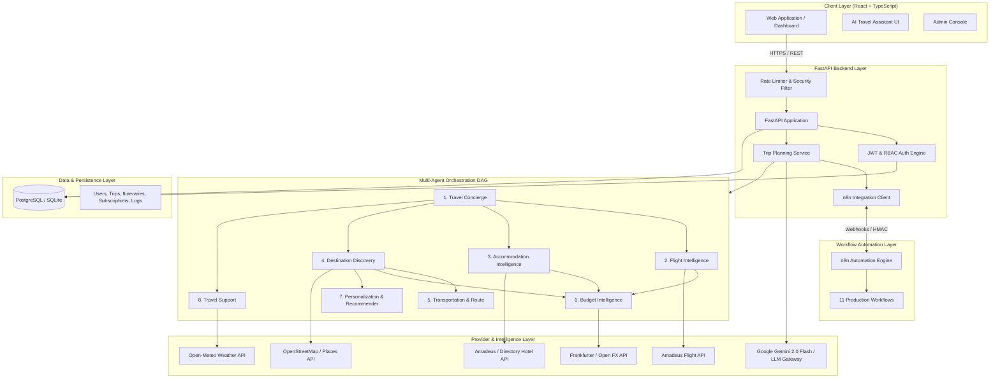

# TravelMind AI — System Architecture Specification

_Version: 2.0 | Status: Production Blueprint_

---

## 1. System Vision & Overview

**TravelMind AI** is an enterprise-grade AI Travel SaaS platform providing intelligent, verified travel planning. The system combines real travel provider intelligence (flights, accommodations, attractions, weather, foreign exchange), autonomous multi-agent orchestration, Gemini AI synthesis, deterministic financial guardrails, and n8n operational workflow automation.

---

## 2. Multi-Agent Orchestration DAG

The 8 specialist agents operate under a dependency-aware directed acyclic graph (DAG) executed asynchronously by `Orchestrator`:

| Step | Agent Name | Depends On | Primary Role | Data Outputs |
|---|---|---|---|---|
| **01** | `travel_concierge` | None | Validates trip requirements, establishes intent and profile constraints | Enriched `TripSpec`, validation status |
| **02** | `flight_intelligence` | `travel_concierge` | Researches flight offers via Amadeus adapter, validates airport codes | Live or cached flight offers, carrier details, durations |
| **03** | `accommodation_intelligence` | `travel_concierge` | Queries hotel availability, room rates, and property amenities | Available properties, nightly prices, location tags |
| **04** | `destination_discovery` | `travel_concierge` | Retrieves verified attractions, culinary spots, and coordinates | POIs, coordinates, categories, ratings, hours |
| **05** | `transportation_route` | `destination_discovery` | Plans airport-to-city transfers and local transit logistics | Transit modes, transfers, navigation advice |
| **06** | `budget_intelligence` | `flight_intelligence`, `accommodation_intelligence`, `destination_discovery` | Calculates exact itemized costs and contingency buffer using Decimal arithmetic | Real budget breakdown, variance analysis, feasibility |
| **07** | `personalization_recommendation` | `destination_discovery`, `budget_intelligence` | Scores options using explainable Data Science recommender | Ranked experiences matching traveler style & interests |
| **08** | `travel_support` | `travel_concierge` | Produces weather-aligned packing lists, visa checks, and reminders | Checklist, scheduled notification triggers |

---

## 3. Real Travel Data Integration Architecture

External providers are wrapped by modular adapters conforming to the `ProviderResult` interface:

1. **Flight Provider (`AmadeusFlightProvider`)**:
   - Authenticates via OAuth 2.0 Client Credentials.
   - Searches `/v2/shopping/flight-offers` for real-time fares, schedules, and carrier codes.
   - Normalizes raw provider payloads into standard flight objects with retrieval timestamps.
   - Falls back gracefully to `UnconfiguredFlightProvider` when credentials are absent.
2. **Accommodation Provider (`AmadeusHotelProvider` / `DirectoryHotelProvider`)**:
   - Retrieves live hotel listings with property metadata, price ranges, and coordinates.
3. **Destination & Places Provider (`OSMPlacesProvider` / `GooglePlacesProvider`)**:
   - Leverages OpenStreetMap Nominatim and Overpass API for real-time attraction, restaurant, and landmark discovery with zero mandatory API key requirement.
   - Supports Google Places API when `PLACES_API_KEY` is provided.
4. **Weather Provider (`OpenMeteoWeatherProvider`)**:
   - Integrates with Open-Meteo REST API for real-time meteorological forecasts (temperatures, precipitation, weather conditions) by destination latitude/longitude.
5. **Currency Exchange Provider (`FrankfurterCurrencyProvider`)**:
   - Queries live foreign exchange rates against USD, EUR, GBP, CAD, AUD, etc., with zero mandatory API key requirement.

---

## 4. Gemini AI Synthesis & LLM Gateway

The itinerary synthesis follows a strict grounding contract:
1. **User Request** arrives at FastAPI.
2. **Provider Research** retrieves actual flights, stays, POIs, weather, and FX.
3. **Agent Orchestration** generates structured context.
4. **Gemini 2.0 Flash REST Client** receives the synthesized prompt containing:
   - Traveler preferences & constraints.
   - Retrieved verified flight offers.
   - Discovered actual hotels and accommodations.
   - Verified attractions and coordinates.
   - Real weather conditions.
5. **Structured Output Enforcement**:
   - The LLM is strictly instructed: **Never hallucinate flight numbers, fictional hotel prices, or fake opening hours**.
   - Output must conform to the day-by-day JSON schema with morning, afternoon, and evening slots.
   - If Gemini is unconfigured or unavailable, the system executes **Grounded Research Synthesis** to produce a realistic, structured itinerary using the real retrieved points of interest.
6. **Deterministic Budgeting**: Total costs are calculated strictly using Decimal math via `compute_budget()`.

---

## 5. n8n Automation Engine Integration

n8n serves as the event-driven workflow engine:
- **FastAPI Dispatcher**: Triggers n8n workflows via HTTP POST with correlation IDs (`x-correlation-id`) and bearer secret (`X-N8N-Webhook-Secret`).
- **Webhook Receiver**: `/api/v1/n8n/webhook` receives execution results, updates trip state, and logs execution.
- **Production Workflows (11 required)**:
  1. Main Travel Planning Orchestrator
  2. Flight Research
  3. Hotel Research
  4. Destination Discovery
  5. AI Itinerary Generation
  6. Budget Optimization
  7. Trip Modification
  8. WhatsApp Travel Assistant
  9. Email Notifications
  10. Scheduled Travel Reminders
  11. Error Handling and Recovery

---

## 6. Database Schema & Domain Model

The persistence layer supports both SQLite (local development) and PostgreSQL (production) via SQLAlchemy Core & ORM:
- **`users`**: User identity, hashed passwords, roles (`traveler`, `admin`), active status.
- **`subscriptions`**: Tier (`free`, `pro`, `enterprise`), stripe customer id, status, quota limits.
- **`trips`**: User ownership, origin, destination, dates, budget, currency, summary, preferences, plan results.
- **`itinerary_items`**: Day index, title, description, category, cost, location.
- **`budget_snapshots`**: Subtotal, contingency, total, currency, category items breakdown.
- **`conversations`**: Chat messages with the AI travel assistant (role, content, timestamp).
- **`preferences`**: Key-value user travel profile preferences.
- **`provider_search_records`**: Audit log of provider API queries and responses.
- **`agent_execution_logs`**: Durations, attempts, errors, and status for each agent run.
- **`notifications`**: Scheduled alerts, flight reminders, weather warnings.
- **`payments`**: Payment records, Stripe transaction IDs, statuses.

---

## 7. Security & SaaS Architecture

1. **Authentication**: JWT tokens signed with HMAC-SHA256, expiration tracking, PBKDF2/bcrypt password hashing.
2. **Authorization**: Strict ownership enforcement (`trip.user_id == current_user.id`) and role checks (`admin` vs `traveler`).
3. **Webhook Security**: Secret token verification (`X-N8N-Webhook-Secret`) and Stripe webhook signature validation.
4. **Rate Limiting**: Sliding window rate limits on public registration and AI planning endpoints.
5. **Data Protection**: Sensitive keys and tokens are never logged or exposed to the frontend.
